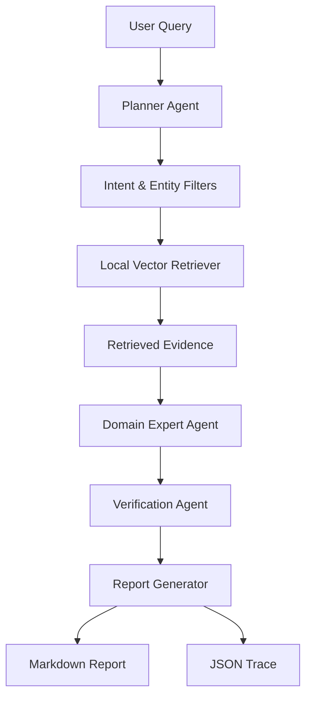
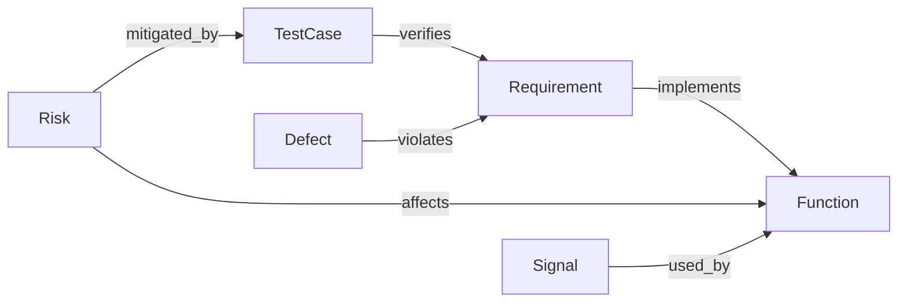

# AutoDev Multi-Agent RAG

面向汽车软件产品开发文档的轻量级 Multi-Agent RAG 原型系统，支持离线检索、规则化多 Agent 推理、citation groundedness 校验、Markdown 报告、JSON trace 和小规模 eval。

## 为什么做这个项目

汽车产品开发文档通常横跨需求、功能、信号、测试、风险和缺陷闭环。普通 RAG 如果只做向量相似度检索，很容易把“看起来相关”的文本拼在一起，却缺少工程实体约束、回答依据校验和可追踪输出。

本项目用一个小而完整的 offline-first MVP 展示“面向汽车产品开发的多智能体协同推理与领域知识工程化研究”：先用轻量 schema 约束检索实体，再由 Planner / Domain Expert / Verification 三类 Agent 完成意图识别、结构化分析和依据校验，最后输出 Markdown report 与 JSON trace。

项目使用公开概念摘要与自构造汽车软件工程样例数据，用于验证 Multi-Agent RAG 方法原型；不包含真实企业数据。

## 系统架构



## 领域 Schema



`data/schema/ontology.yaml` 定义了 Requirement、Function、Signal、TestCase、Risk、Defect 六类实体，以及 implements、verifies、affects、mitigated_by、violates、used_by 六类关系。

## 核心模块

- Document Loader：读取 `data/docs/*.md`，提取 `doc_id`、标题、正文和 source metadata。
- Ontology Schema：用 Pydantic + YAML 表达轻量汽车软件工程 schema。
- Local Vector Retriever：基于 scikit-learn TF-IDF 的离线检索器，支持 `function` 和 `entity_type` metadata filter。
- Planner Agent：规则化识别需求分析、测试生成、风险分析、缺陷诊断和通用问答意图。
- Domain Expert Agent：从检索片段中选择实际使用的 evidence，提取工程实体 ID，并生成结构化回答与 `doc_id#chunk_id` citation。
- Verification Agent：校验 citation validity、被引用证据中的实体支撑、查询焦点覆盖和过度引用风险，输出 groundedness score。
- Report Generator：生成可读 Markdown 分析报告。
- Evaluator：基于 20 条 eval case 统计 intent accuracy、entity recall、citation hit rate、groundedness score 和 invalid answer rate。

## 快速开始

```bash
python -m venv .venv
source .venv/bin/activate
pip install -r requirements.txt
python -m autodev_rag.cli build-index
python -m autodev_rag.cli ask "AEB 在雨天低速场景误触发可能涉及哪些风险和测试补充？"
python -m autodev_rag.cli eval
pytest
```

Windows PowerShell 激活环境：

```powershell
.venv\Scripts\activate
```

也可以指定路径：

```bash
python -m autodev_rag.cli build-index --docs data/docs --index outputs/index.pkl
python -m autodev_rag.cli ask "BUG-AEB-001 应该如何定位？" --index outputs/index.pkl
```

## 示例输出

```text
AutoDev RAG Result
intent           risk_analysis
target_function  AEB
top_citations    06_risk_analysis_examples#chunk_000, 05_test_case_examples#chunk_000, 01_aeb_requirement#chunk_001
final_verdict    pass
report_path      outputs/report_<hash>.md
```

每次 `ask` 会在 `outputs/` 下生成：

- `report_<hash>.md`：面向阅读的 Markdown 分析报告
- `trace_<hash>.json`：面向调试的完整 pipeline trace

## 评测指标

- `intent_accuracy`：Planner 意图是否命中预期。
- `avg_entity_recall`：检索结果 metadata 中的实体类型覆盖率。
- `citation_hit_rate`：回答 citation 是否命中预期文档。
- `avg_groundedness_score`：Verification Agent 给出的依据充分性分数。
- `invalid_answer_rate`：最终 verdict 为 `fail` 的比例。

运行：

```bash
python -m autodev_rag.cli eval --cases data/eval/eval_cases.jsonl --index outputs/index.pkl
```

## Eval Result

本地运行 `python -m autodev_rag.cli eval` 的结果：

| Metric | Value |
| --- | ---: |
| total | 20 |
| intent_accuracy | 1.000 |
| avg_entity_recall | 0.854 |
| citation_hit_rate | 1.000 |
| avg_groundedness_score | 0.992 |
| invalid_answer_rate | 0.000 |

## 项目边界

- 样例文档全部为自构造数据，不包含真实企业内部资料。
- 默认使用 local deterministic mode，不需要 OpenAI API Key。
- `OpenAICompatibleLLM` 仅保留扩展接口，测试和 demo 不依赖外部网络。
- 本项目不完整实现 ISO 26262、ASPICE 或 SOTIF，仅引用这些公开概念作为过程背景。
- 不进行 LoRA 微调，不接 Neo4j，不引入 LangChain / LlamaIndex / ChromaDB 等重型框架。

## 简历 Bullet

版本 A：三条详细版

- 构建 AutoDev Multi-Agent RAG 原型，面向汽车软件开发文档设计需求、功能、信号、测试用例、风险与缺陷等轻量领域 schema，结合本地向量检索与 metadata filter 支持需求分析、风险识别、测试补充和缺陷诊断场景。
- 设计 Planner / Domain Expert / Verification 三类 Agent，将复杂工程问题拆解为意图识别、结构化检索、依据生成与回答校验，输出带 citation 的 Markdown 分析报告和 JSON trace，提升回答可追踪性与可校验性。
- 构建 20 条汽车开发问答与推理评测 case，统计 intent accuracy、entity recall、citation hit rate、groundedness score 与 invalid answer rate，用于验证 Multi-Agent RAG 链路在工程文档问答中的稳定性。

版本 B：两条压缩版

- 构建面向汽车软件开发文档的 AutoDev Multi-Agent RAG 原型，设计需求、功能、信号、测试、风险、缺陷等领域 schema，并结合向量检索与 metadata filter 生成结构化工程分析报告。
- 设计 Planner / Domain Expert / Verifier 多 Agent 链路，基于 20 条评测 case 统计 intent accuracy、entity recall、citation coverage 与 invalid answer rate，验证回答依据性与无依据回答控制效果。
